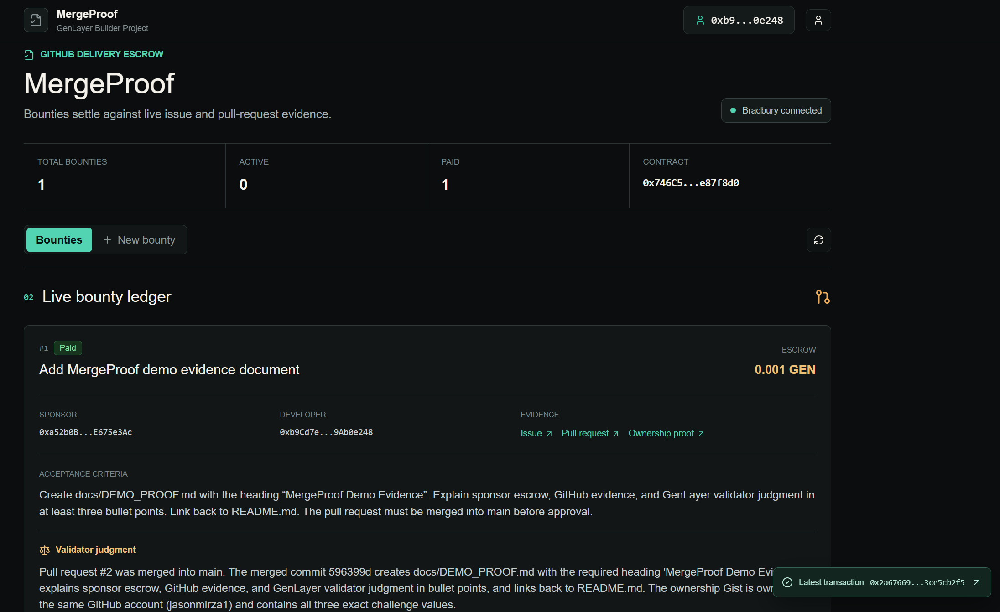

# MergeProof

MergeProof is GitHub bounty escrow that releases payment only after GenLayer validators inspect live issue and pull-request evidence. A sponsor writes the acceptance criteria before funding the bounty. A developer submits a pull request from the same repository. The Intelligent Contract fetches both pages and judges whether the pull request is merged and the written criteria are supported by visible evidence.

**Live app:** https://genlayer-mergeproof.vercel.app

**Demo video:** https://youtu.be/m0RhEOSz7jc

This is a trust problem rather than a request for a better AI answer: an irreversible GEN transfer depends on a qualitative commercial outcome. The judgment and payout happen in one Intelligent Contract transaction, so neither party controls the evaluator or a private backend.

## Workflow

1. A sponsor creates a bounty from a public GitHub issue, writes specific acceptance criteria, and escrows GEN.
2. A developer creates a public Gist from the pull-request author's GitHub account containing the app-generated bounty, PR, and wallet ownership challenge.
3. The developer submits the public pull request and ownership-proof Gist from the wallet named in that challenge.
4. Any user can trigger evaluation. Validators independently fetch the issue, pull request, and ownership Gist.
5. Equivalent validator judgments release escrow only when the work qualifies, the Gist owner is the PR author, and the Gist challenge matches the claimant wallet. Missing work or failed ownership requests revision.
6. The frontend waits for finalized judgment before showing payment as complete. A sponsor may refund an open bounty or a bounty awaiting revision, or reopen a `SUBMITTED` bounty after the bounded two-hour recovery window if evaluation cannot complete and the worker does not withdraw. Released funds cannot be reclaimed.

## Why GenLayer

Normal contracts cannot decide whether a pull request actually satisfies prose acceptance criteria or whether the claimant controls its author account. MergeProof uses `gl.nondet.web.render` to collect live GitHub and Gist evidence and `gl.eq_principle.prompt_comparative` to require validators to agree on the substantive outcome, criterion coverage, and claimant ownership. Valid JSON alone is explicitly insufficient. The contract also treats repository text as untrusted evidence and instructs validators to ignore embedded prompt injection.

## Claimant ownership

The frontend generates an ownership challenge tied to the bounty ID, canonical pull-request URL, and connected wallet. The claimant publishes it as a public Gist from the same GitHub account that authored the pull request. Validators require all of the following before payment:

- the pull-request author is visible;
- the Gist owner matches that author;
- the Gist contains the exact bounty, pull-request, and wallet values;
- the connected claimant wallet matches the challenged wallet.

An unrelated wallet can submit a qualifying PR URL, but it cannot release escrow without a matching Gist controlled by the PR author. The direct test `test_stolen_pull_request_cannot_be_claimed_by_unrelated_wallet` proves this failure path transfers no funds.

## Contract

- Source: [`contracts/mergeproof.py`](contracts/mergeproof.py)
- Direct tests: [`tests/direct/test_mergeproof.py`](tests/direct/test_mergeproof.py)
- Integration negative test: [`tests/integration/test_mergeproof_ownership.py`](tests/integration/test_mergeproof_ownership.py)
- Frontend: <https://genlayer-mergeproof.vercel.app>
- Bradbury network: chain ID `4221`
- Current Bradbury contract: [`0xFA8B33103A53fA14f4a7147ac4C24d3aFf225FeB`](https://explorer-bradbury.genlayer.com/address/0xFA8B33103A53fA14f4a7147ac4C24d3aFf225FeB)
- Current deployment transaction: [`0xac5f7deb293984c4ed31e30bcde307cc58b9a04caa8ba959235378273c06b26b`](https://explorer-bradbury.genlayer.com/tx/0xac5f7deb293984c4ed31e30bcde307cc58b9a04caa8ba959235378273c06b26b)
- Finalized ownership-bound settlement: [`0x55f6f0feb42c0bda1284ea96a3b8e6e1ed838a826171315e6aacee5944406c1e`](https://explorer-bradbury.genlayer.com/tx/0x55f6f0feb42c0bda1284ea96a3b8e6e1ed838a826171315e6aacee5944406c1e)
- Previous corrected ownership deployment: [`0x746C51C257dF5e4b34466BAE1ce692e3fe87f8d0`](https://explorer-bradbury.genlayer.com/address/0x746C51C257dF5e4b34466BAE1ce692e3fe87f8d0)
- Verified ownership settlement on the previous corrected deployment: [`0x2a67669764456a7cff9fcb7279fb3ef7933e585202b5dcfa1da8e2b3ce5cb2f5`](https://explorer-bradbury.genlayer.com/tx/0x2a67669764456a7cff9fcb7279fb3ef7933e585202b5dcfa1da8e2b3ce5cb2f5)
- Ownership proof: [`jasonmirza1/a1bd857282950b18b8162f87e64c0a9c`](https://gist.github.com/jasonmirza1/a1bd857282950b18b8162f87e64c0a9c)
- Network: GenLayer Bradbury, chain ID `4221`



Previous Bradbury deployments are deprecated: `0xce85AB1F823e97a5E35ae07BAf205c1368B2F56a` captured storage inside nondeterministic mode; `0x7b504D51bB0C91EFC2ea6c35A50Eb6bE5f965aaf` was superseded by withdrawal recovery; `0x5610791050A2D7255F1CBD0802fBd9e41A5F205c` did not bind claimant wallets to GitHub author ownership; and `0x6312A9ED01a500f752C1F9d328473a6572b135bA` was superseded by deterministic recovery timing and full accepted-to-finalized frontend handling. The `0x746C...` deployment is retained only as prior ownership-settlement evidence. The current submission deployment is `0xFA8B...`.

### State lifecycle

```text
OPEN -> SUBMITTED -> RELEASED
  |         |
  |         +-> OPEN (sponsor recovery after two hours)
  |         +-> REVISION_REQUESTED -> SUBMITTED
  |                    |
  +--------------------+-> REFUNDED
```

`RELEASED` is only surfaced by the frontend from finalized contract state. Every write first reports submission, then accepted consensus, and waits for `FINALIZED` before refreshing the finalized ledger or showing completion. The polling window is long enough for Bradbury's observed consensus and finality delays.

## Run locally

Requirements: Node.js, Python, the GenLayer CLI, and `genvm-lint`.

```powershell
npm install
Copy-Item frontend\.env.example frontend\.env
npm run dev
```

Open <http://127.0.0.1:3000>. Set `NEXT_PUBLIC_CONTRACT_ADDRESS` in the uncommitted `frontend/.env` after deployment. Connect an EVM wallet on GenLayer Bradbury.

## Verify

```powershell
npm run build
npm run lint
python -m pytest tests\direct\test_mergeproof.py -v
genvm-lint check contracts\mergeproof.py
```

The ownership-mismatch integration test is opt-in because it needs a running GenLayer localnet or Studio-compatible endpoint with the test fixtures available:

```powershell
$env:MERGEPROOF_RUN_INTEGRATION = "1"
gltest tests/integration -v -s
```

## Deploy

Keep deployment credentials only in the ignored root `.env`; `.env.example` contains placeholders.

```powershell
genlayer network testnet-bradbury
npm run deploy
```

After deployment, put the address in your local `frontend/.env`. Never commit a private key, seed phrase, or funded `.env` file.

## Limitations

- Only public canonical GitHub issue and pull-request URLs are accepted.
- Ownership proofs must be canonical public GitHub Gist URLs owned by the pull-request author.
- GitHub availability and page rendering affect evidence quality; weak evidence requests revision instead of paying.
- Validators judge the visible diff and discussion. They do not execute arbitrary repository code.
- Sponsor cancellation is intentionally limited to `OPEN` and `REVISION_REQUESTED`; it is unavailable during evaluation or after release.
- A `SUBMITTED` bounty is recoverable only by its sponsor after the two-hour bounded delay; the recovery action clears the worker evidence and reopens the escrow for a new submission.

## License

MIT
